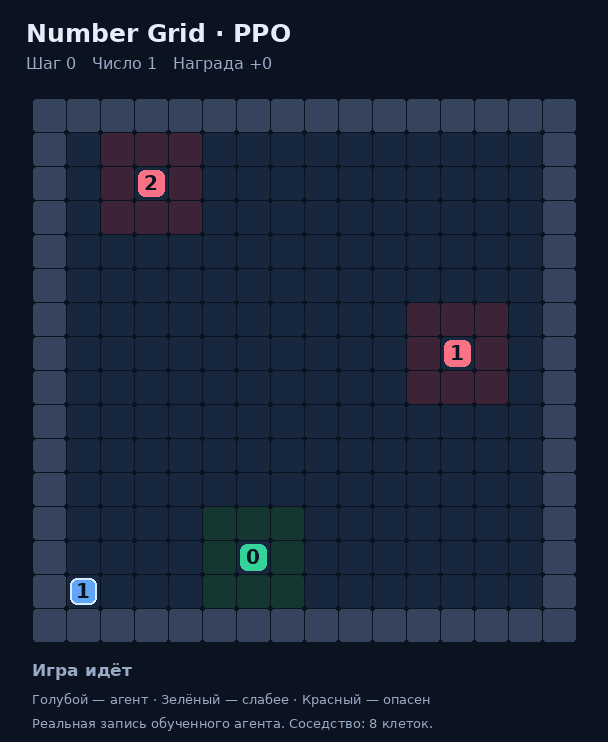

# JAX PPO: NumberGrid, Navix и Craftax

Проект содержит полные исходники Stoix, собственную среду NumberGrid 16×16,
PPO-бенчмарки, сохранённые модели и автономную интерактивную визуализацию.
Обучение выполняется через штатный Stoix Anakin feedforward PPO на GPU.

## Собственная среда

Агент начинает с числом 1 и ходит в восьми направлениях. Три неподвижных
оппонента имеют числа 0, 1 и 2. При контакте по любой из восьми соседних клеток
слабый оппонент исчезает, агент получает +1 к числу и +1 награды. Равный или
более сильный сосед завершает эпизод с −1; поражение имеет приоритет. За
исчезновение всех оппонентов добавляется +3. Стены по периметру, расположение
участников фиксировано, таймаут 2000 шагов. Подробности: [NUMBER_GRID.md](NUMBER_GRID.md).



Интерактивная карта: [viewer.html](results/number-grid-5m/viewer.html).
Скачайте файл и откройте его в браузере: доступны реальные записи PPO и ручная
игра. Сервер и интернет не нужны. Исходники интерфейса также включены.

## Измеренные результаты

RTX 5090, JAX 0.11.2, CUDA runtime 13.2.86, seed 42. Каждый запуск обучается
ровно на 5 млн переходов. Скорость включает сбор траекторий и обновления PPO;
время компиляции измерено отдельно. Все вызовы learner синхронизированы.

| Среда | Обучение, с | Переходов/с | Компиляция PPO, с | Финальная оценка |
|---|---:|---:|---:|---|
| NumberGrid 16×16 | 2.224 | 2 248 126 | 21.732 | 1024/1024 побед, награда 6, 17 ходов |
| Navix-DoorKey-16x16-v0 | 2.751 | 1 817 801 | 25.587 | 0/64 побед |
| Craftax-Symbolic-v1 | 36.474 | 137 085 | 72.588 | Средняя награда 6.194 на 64 эпизодах |

Результат NumberGrid относится к одной фиксированной карте. 17 ходов —
проверенный кратчайший победный путь. Navix за этот бюджет среду не освоил;
положительная награда Craftax не означает прохождение игры.

Полные конфигурации, метрики, checkpoint и версии находятся в `results/`.
Протоколы: [NumberGrid](NUMBER_GRID.md), [Navix](BENCHMARK.md),
[Craftax](CRAFTAX_BENCHMARK.md).

## Установка

Linux, Python 3.12, NVIDIA GPU и драйвер, поддерживающий CUDA 13.2.
`uv` должен быть установлен. Из корня клонированного репозитория:

```bash
bash scripts/install_runtime.sh
env -u LD_LIBRARY_PATH JAX_PLATFORMS=cuda .venv/bin/python -c \
  'import jax; print(jax.devices())'
```

Установщик закрепляет runtime измеренного запуска и ставит локальные Stoix и
Stoa в editable-режиме без upstream-набора необязательных движков. Исходный
`pyproject.toml` Stoix ограничивает JAX старой версией; для этих бенчмарков
используется `craftax-runtime.txt` и `runtime-constraints.txt`.
Исходный `uv.lock` сохранён как часть upstream, он не описывает этот runtime.

## Запуск

```bash
env -u LD_LIBRARY_PATH JAX_PLATFORMS=cuda \
  XLA_PYTHON_CLIENT_PREALLOCATE=false MPLBACKEND=Agg \
  .venv/bin/python benchmark_number_grid.py

MPLBACKEND=Agg .venv/bin/python export_number_grid.py
```

Для двух других сред замените имя скрипта на `benchmark_navix.py` или
`benchmark_craftax.py`. `--smoke` выполняет отдельный короткий запуск.
Повторный полный запуск перезаписывает результаты соответствующей среды.
Шаблоны supervisor для текущего Vast-инстанса лежат в `deploy/supervisor/`.

Проверки среды и соответствия браузерных правил реальным JAX-записям:

```bash
env -u LD_LIBRARY_PATH JAX_PLATFORMS=cuda \
  .venv/bin/python -m pytest stoix/tests/number_grid_test.py -q
node verify_number_grid_viewer.cjs
```

20 тестов среды пройдены на GPU. Сверены все 153 перехода девяти записей.
Браузер проверен на экранах 1200×1080 и 390×844: воспроизведение победы,
клавиатура, ручное прохождение, отсутствие ошибок JavaScript и горизонтального
переполнения. Отчёт сохранён вместе с результатами NumberGrid.

## Источники и лицензия

- Stoix: https://github.com/EdanToledo/Stoix,
  commit `8fff19c94a478c1e1ff75fbf10396d488aa25d70`.
  Исходная документация: [README_STOIX.md](README_STOIX.md).
- Stoa: https://github.com/EdanToledo/Stoa,
  commit `b3a084ed05893c301e079a8f527de90513896d7e`.
  Полные исходники с исправлениями совместимости включены в `stoa-src/`.
- PPO не изменён. Дополнены регистрация среды и совместимость logger/Stoa.

Лицензии upstream Apache-2.0 сохранены в `LICENSE` и `stoa-src/LICENSE`.
