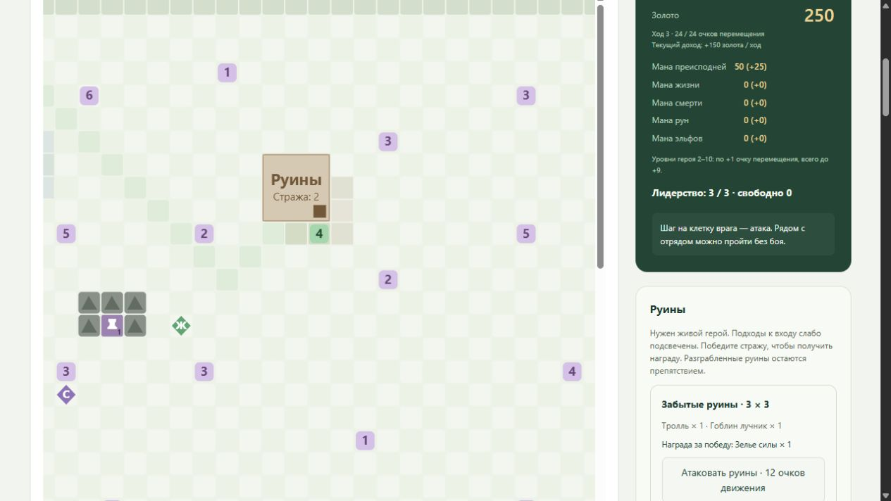

# Руины

Руины добавлены в v80. Текущая карта v81: наблюдение v37, **1526 признаков и 195 действий**.
Руины «Забытые руины» расположены в [7,23] (строка, столбец верхнего левого угла).
Они занимают квадрат 3×3: строки 7–9, столбцы 23–25. Нижняя правая клетка
[9,25] — цель команды нападения. Допустимые внешние подходы:
[8,26], [9,26], [10,24], [10,25], [10,26]. В визуализации они слабо выделены.

Защитники — тролль g000uu5016 (350 HP, 120 урона, инициатива 40),
занимающий переднюю и заднюю клетки центральной линии, и гоблин-лучник
G000UU5018 (40 HP, 15 урона, инициатива 50) в верхнем заднем слоте.
Это обычный тролль, не вариант предводителя g000uu5116. Они используют
общие характеристики, опыт, размер, досягаемость и боевые правила.

Для нападения нужен живой настоящий герой и хотя бы одно очко движения.
Команда 0–7 в сторону входа начинает обычный бой. Стоимость — половина
максимального запаса движения с округлением вверх, ограниченная остатком.
Отряд остаётся на своей клетке. Подойти с обратной стороны постройки нельзя.
Маска и принудительный step одинаково проверяют эти условия.
Защитники руин от страха парализуются, как в Python-референсе; атакующий
отряд может отступить от страха. Городскую броню руины не дают.

После полной победы отряд один раз получает **Зелье силы** G000IG0015:
+30% урона выбранному живому бойцу до следующего отдыха. Это временное зелье,
а не постоянный эликсир титана. Награда текущих руин не содержит золота.
Победа без живого героя в конце боя всё равно выдаёт добычу оставшимся
бойцам; живой герой требуется при входе. Отступление, поражение и прекращение
боя без победы добычу не выдают. Враги после отступления восстанавливаются
по общему правилу среды. Очистка учитывает заключительные ходы целителей.

Руины получают признак «разграблены», их стража удаляется с карты, повторный
бой и повторная награда недоступны. Все девять клеток остаются препятствием
и не входят в распространение земли. В новом эпизоде стража и награда
восстанавливаются. Обычные полевые отряды сохраняют прежнее поведение.

Конфигурация поддерживает список ruins с position, name, potions, items и
необязательным gold. Снаряжение проходит через общий инвентарь и автовыбор:
артефакты и сапоги сразу учитываются в характеристиках по действующим правилам.
Ёмкость инвентаря включает все сундуки и руины. Запас зелий и набор действий
учитывают добычу руин даже до её получения.

Дополнительная награда RL за очистку — +0,25 поверх обычной +1 за бой,
как стандартный reward_ruin_clear_bonus Python-референса. Обычная цена шага,
штраф свободного лидерства и +3 за полную победу на карте сохраняются.
Отдельное действие входа не добавляется. Зелье силы добавило 6 действий
применения: теперь 18 доступных видов × 6 целей. Покупки — 171–173,
тренер — 174–179, найм своей фракции — 180–184, наёмники — 185–186,
увольнение — 187–192, улучшения городов — 193–194.

В наблюдение добавлены пять признаков нового отряда, шесть признаков нового
вида зелья (инвентарь и пять сундуков) и 37 признаков руин: координаты,
18 количеств зелий, 15 количеств предметов, золото и флаг разграбления.
Старые веса v35 не подходят новому размеру наблюдения и действий.

## Источники и границы переноса

- Python-референс Big_map/maps/default.py:381–410,568–603 и
  maps/wotans_retribution.py:65–88,268+: размер 3×3, маркер в нижнем правом
  углу, один отряд защитников, предметы и золото. Пять внешних подходов
  следуют из восьми направлений движения и восьми блокированных клеток.
- campaign_env_map.py:10–30 и campaign_env.py:1484: руины требуют живого героя.
- campaign_env_territory.py:724–803: однократная награда, инвентарь, золото,
  множество очищенных руин. campaign_env_battle.py:250–320: награда после
  победы, возвращение на исходную клетку; :807–839 — страх защитников.
- campaign_env.py:315–317 и campaign_env_inventory.py:3408+: бонус RL.
- Установленное DII Manual.pdf, разделы The Game Landscape и Combat:
  стража, ценности, отсутствие повторной добычи, запрет посещения с мёртвым
  лидером. Использована сохранённая текстовая выдержка Big_map/tmp/manual.txt.
- Установленное Scenedit manual/Disciples 2 Scenario Editor Manual.htm,
  раздел Ruins: состав стражи, Bonus Gold, Reward Selection, Looted Button.
  Разграбленные руины не допускают действий.
- Globals/Gunits.dbf, GAttacks.dbf, GItem.dbf, GmodifL.dbf установленной
  Rise of the Elves и импортированные каталоги: тролль, гоблин-лучник,
  G000IG0015 и модификатор +30% damage. Хеши и значения сохранены в
  [ruin-sources.json](validation/ruin-sources.json).

Координаты, состав и награда — настройки текущего сценария по запросу
пользователя. Референс оставляет клетку маркера отдельно от восьми статических
препятствий и не блокирует её дополнительно после очистки. Здесь по прямому
запросу пользователя весь квадрат остаётся препятствием: вход разрешён
только как нападение, без физического перехода внутрь. Это отличие явно
зафиксировано; оригинальная игра и IDA автоматически не запускались.

Проверки: number_grid_ruins_test.py (геометрия, живой герой, JIT/vmap,
стоимость входа, однократная добыча, эффект зелья, экипировка, reset,
страх, отсутствие брони и данные интерфейса); общий маршрут через все
46 отрядов и оба города в number_grid_combat_stats_test.py.

Полный контрольный CUDA-прогон: **377 passed**, 798,29 с pytest,
**816,41 с (13:36)** с подготовкой и компиляцией. Постоянный кеш включён,
все тесты выполнены заново. Ruff и JavaScript syntax прошли.
[Протокол проверок](validation/ruin-checks.json).

Замер на 1 млн переходов: **97 713 переходов/с**, −3,92% к v79 при тех же
PPO, seed, GPU и библиотеках. [Протокол](validation/ruin-performance.json).
W&B сохранён offline (idlgy4ds), онлайн-графика нет.

Ручная проверка интерфейса: отряд дошёл до [10,25] обычными командами,
атаковал за 12/24 очков, победил тролля и гоблина-лучника и получил ровно
одно зелье силы. Серые разграбленные руины остались непроходимыми; повторная
атака исчезла. Новый эпизод восстановил стражу. Ошибок JavaScript нет,
GET /viewer.html — 200. [Протокол UI](validation/ruin-ui.json).

