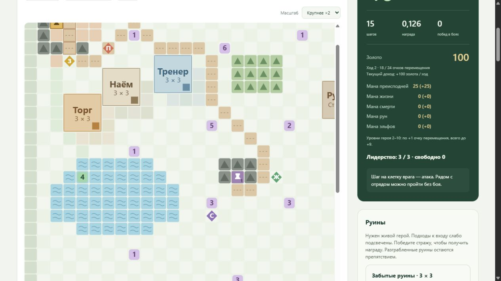

# Рельеф и передвижение

Карта v81, наблюдение v37: **1526 признаков, 195 действий**.

| Местность назначения | Живой пеший герой | Живой летающий герой | Погибший герой |
|---|---:|---:|---:|
| Равнина | 2 | 2 | 4 |
| Дорога | 1 | 2 | 2 |
| Лес | 4 | 2 | 8 |
| Вода | 6 | 2 | 12 |

Цена зависит от клетки назначения. Диагональ стоит столько же. Пока остаётся
хотя бы одно очко, разрешён последний неполный шаг: списывается минимум цены
и остатка. При нуле очков нужно закончить ход отдыхом. Маска, принудительный
step, стоимость команды в интерфейсе и PPO используют одну JAX-среду.

Полёт определяется по настоящему герою: Рыцарь на пегасе g000uu0019,
Архангел g000uu0022, Архидьявол g000uu0072, Баньши g000uu0099. Наличие
летающего обычного бойца, призванного или скопированного героя полёта отряду
не даёт. Живой летающий герой всегда платит 2, в том числе на дороге.
Полёт не разрешает пересекать горы, границы или постройки.

После гибели героя полёт отключается, базовые цены местности удваиваются.
Снаряжение остаётся в инвентаре, но бонусы сапог не действуют. Воскрешение
восстанавливает полёт и автоматическую экипировку. Запас очков дополнительно
не делится пополам: референс реализует снижение дальности удвоенной ценой
шага. Иначе штраф был бы применён дважды. Ограничение роста движения +9
на уровнях 2–10 сохраняется по ранее заданному правилу пользователя.
Без героя в составе цена обычная; штраф применяется к присутствующему
погибшему герою, как в референсе.

Elven Boots снижают цену леса до 2, Boots of the Elements — воды до 2
при живом герое и экипированных сапогах. Прежняя схема автовыбора сапог
сохраняется. На карте эти сапоги пока не размещены; работают в сценариях,
которые включают их в начальный инвентарь, сундук или руины.
Атака врага по-прежнему стоит половину полного запаса с округлением вверх,
ограниченную остатком, независимо от рельефа и удвоения цены ходьбы.

На карте 26 клеток дороги (в том числе подход к столице и первому городу),
32 клетки леса и один связный водоём ровно из 50 клеток: строки 13–18,
столбцы 2–11. Водоём не пересекает армии, источники, сундуки, города,
столицу, препятствия или постройки. Вода проходима для отряда, но не входит
в распространение земли и не даёт бонус регенерации родной земли. Лес и
дороги допускают распространение земли. Проверка достижимости объектов
использует проходимость отряда, отдельно от достижимости для земли.

В интерфейсе показаны вода с волнами, лес с деревьями, дороги, легенда,
подсказка местности и цены восьми команд. Цены и признаки смерти/полёта
берутся из JAX; браузер только отображает данные и отправляет действия.

К наблюдению добавлены 35 признаков: типы местности в окне 5×5 (0=равнина,
1=дорога, 2=лес, 3=вода; деление на 3), восемь полных цен входа /12,
флаг активного полёта и флаг погибшего героя. Цены включают сапоги и смерть,
но не обрезаны оставшимися очками. Полные цены позволяют различать
варианты местности даже перед последним неполным шагом. Старые веса v36
несовместимы с размером наблюдения; действия и награды не расширены.

Источники: Python campaign_env_data.py:155–176, campaign_env_map.py:120–200,
campaign_env.py:1497–1518, campaign_env_inventory.py:2075–2115,
campaign_env_territory.py:1612–1630. Установленное руководство DII Manual.pdf,
раздел Movement and Terrain Type, подтверждает цены 1/2/4/6; раздел Combat
описывает снижение дальности при погибшем лидере вдвое. Полёт и последнее
неполное движение перенесены из референса; оригинальная игра и IDA не
запускались. [Точные файлы и хеши](validation/terrain-sources.json).

Проверки: number_grid_terrain_test.py — фактический step, маска и котировки,
четыре летающих героя, смерть, воскрешение, сапоги, диагонали, последний шаг,
водоём, земля, наблюдение, reset и сервер; number_grid_turns_test.py и
number_grid_engagement_test.py — регрессии ходов и атак.

Полный контрольный прогон: **384 passed**, pytest 664,63 с; полное время
с подготовкой и компиляцией **674,25 с (11:14)**. Постоянный кеш компиляции
включён, все тесты исполнены заново. Ruff, JavaScript syntax и diff check
прошли. [Протокол](validation/terrain-checks.json).

Замер 1 млн переходов: **101 060 переходов/с**, +3,42% относительно v80
(97 713) при тех же seed 42, 250 средах, rollout 100, PPO, GTX 1660 Ti,
JAX 0.11.2 и CUDA 13.4.92. Измеряемое обучение 9,90 с; PPO-компиляция
66,59 с, оценки 54,36 / 65,99 / 63,87 с, сохранение 0,30 с.
Проверена обратная загрузка контрольной точки. W&B offline: o9vipl85;
онлайн-графика нет. [Протокол](validation/terrain-performance.json).

Ручная проверка: дорога 20→19, равнина 19→17, последний шаг в озеро
3→0, после отдыха следующий водный шаг 24→18. Подтверждены отрисовка
рельефа и цены направлений. Полёт проверен CUDA-тестами: выбор фракции в
существующем интерфейсе не заменяет начального герцога. В конце открыт
новый эпизод Легионов; GET страницы — 200, ошибок JavaScript нет.
[Протокол ручной игры](validation/terrain-ui.json).

